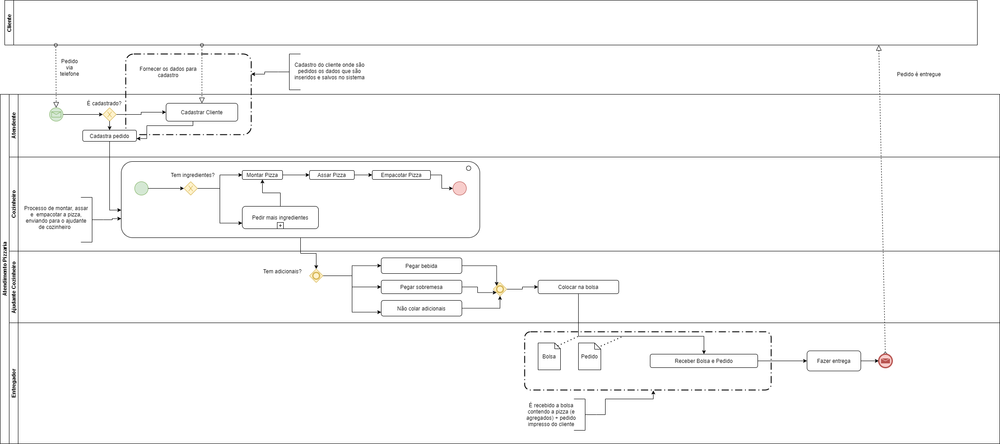
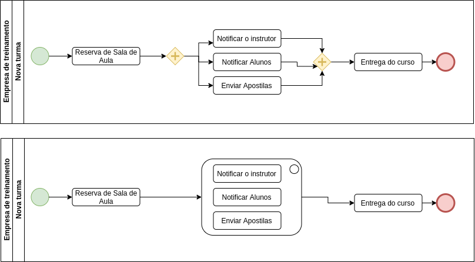

# Atividade
## Atividade aula 22/10/2020

Represente em processos colaborativos o seguinte cenário: 

1. O cliente (participante externo) faz o pedido para a pizzaria via telefone; 
2. A atendente (papel interno) identifica se o cliente já está cadastrado no sistema; 
3. Se for um novo cliente, primeiro é feito seu cadastro. Se o cliente já estiver cadastrado, a atendente digita o pedido no sistema; 
4. Após o pedido ser digitado a atendente imprime o pedido e repassa para a cozinha iniciar a produção; 
5. Na cozinha ocorrem as seguintes tarefas; 

   - A pizza é montada, assada e colocada na caixa para a entrega; 
   - Em seguida alguém verifica no pedido se o cliente pediu bebida e/ou sobremesa; 
   - No final os itens do pedido são colocados na bolsa térmica para transporte. 
6. A bolsa é entregue ao entregador (papel interno), que recebe também o pedido impresso com o endereço para a entrega. O entregador realiza a entrega do pedido; 
7. O cliente recebe o pedido e os processos são finalizados.

[Baixar imagem](trabalho2.png)

---

## Atividade 02

Você vai modelar o processo de suporte técnico de uma empresa de condicionadores de ar. O processo inicia no SAC (Serviço de atendimento ao cliente). Você entrevistou o analista de suporte e ele explicou resumidamente o fluxo padrão para resolver problemas técnicos que são relatados pelos clientes após instalação do aparelho:

* Recebido um novo caso (problema), a analista de suporte faz o registro no sistema de
atendimento.

* Após o registro a analista de suporte escala o caso para um técnico disponível.

* Na saída da tarefa escalação é impresso um formulário de atendimento contendo os dados do cliente e informações sobre o caso.

* O técnico recebe o caso junto com o formulário de atendimento e agenda com o cliente uma visita técnica.

* Na visita o técnico diagnostica o problema no aparelho e faz a manutenção necessária.

* Após finalizara manutenção o técnico completa a formulário de atendimento relatando
qual era a causa do problema e/ou peças que foram trocadas.

* O Técnico então repassa o formulário de atendimento preenchido para a analista de suporte, que entra em contato com o cliente para verificar se o problema foi resolvido.

* Em seguida a analista de suporte encerra o caso aberto no sistema de atendimento e o
processo é finalizado.

Modele o processo As-Is do suporte técnico utilizando o Bizagi.

Represente o “caminho do dia feliz” (não é necessário representar o cliente como participante deste processo).

Represente o processo provado que ocorre dentro da empresa (não é necessário representar o cliente como participante deste processo).

Utilize uma piscina com raias para representar os papéis internos.

Use e abuse dos artefatos para documentar o que acontece dentro do processo.

# Tarefas
## Tarefa 01 

